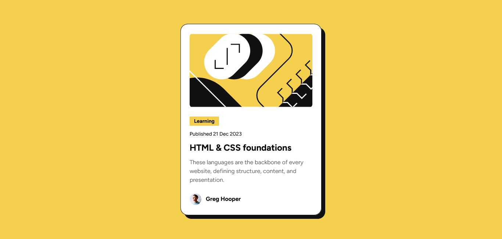

# Frontend Mentor - Blog preview card solution

This is a solution to the [Blog preview card challenge on Frontend Mentor](https://www.frontendmentor.io/challenges/blog-preview-card-ckPaj01IcS). Frontend Mentor challenges help you improve your coding skills by building realistic projects.

## Table of contents

-   [Overview](#overview)
    -   [The challenge](#the-challenge)
    -   [Screenshot](#screenshot)
    -   [Links](#links)
-   [My process](#my-process)
    -   [Built with](#built-with)
    -   [What I learned](#what-i-learned)
    -   [Continued development](#continued-development)
-   [Author](#author)

## Overview

### The challenge

Users should be able to:

-   See hover and focus states for all interactive elements on the page

### Screenshot



### Links

-   Solution URL: [Add solution URL here](https://your-solution-url.com)
-   Live Site URL: [Add live site URL here](https://your-live-site-url.com)

## My process

### Built with

-   Semantic HTML5 markup
-   CSS custom properties
-   Flexbox

### What I learned

-Making use of gap in flexbox instead of margin and padding

```css
.container {
    display: flex;
    gap: 10px;
}
```

### Continued development

Having struggled quite a bit with flexbox layout, I'm planning to dive deeper into flexbox and grid system in future projects. Scaling svgs alongside of its container proved to be challenging too, and lastly I will properly learn about media query techniques as it's one of my shortcomings from this project

## Author

-   Frontend Mentor - [@Joliot-TSIMISARAKA](https://www.frontendmentor.io/profile/Joliot-TSIMISARAKA)
-   Twitter - [@JoliotSitraka](https://x.com/JoliotSitraka)
